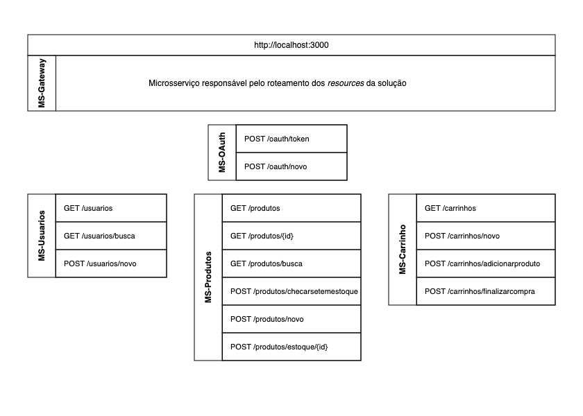
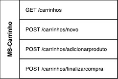
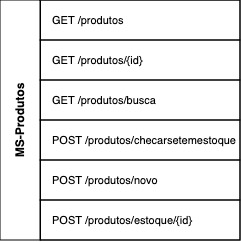
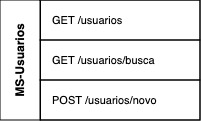

# Tech Challenge

Bem-vindo(a) a documentação oficial da API desenvolvidas para o **Tech Challenge Fase 5**. Nesta documentação, você
encontrará detalhes abrangentes sobre a API, que foi desenvolvida como parte deste projeto.

## Integrantes

- Daniel Reis de Medeiros Guimarães
- Felipe Ferreira de Paula
- João Pedro Gomes
- Rafael Souza Araujo

## Link do Respositório

- [Repositório Fiap Tech Challenge](https://github.com/danguimaraes86/fiap-tech-challenge)

## Desafio

Neste desafio, vamos desenvolver um sistema de e-commerce que permita aos usuários realizarem as seguintes operações:

1. Login e Registro de Usuário: Os usuários devem ser capazes de se cadastrar e fazer login no sistema usando as
   ferramentas do Spring Security para autenticação e autorização.
2. Gestão de Itens: Os usuários administradores terão acesso a uma tela de gestão de itens, basicamente o controle
   de cadastro e manutenção de itens, bem como seus preços.
3. Carrinho de Compras: Os usuários podem adicionar e remover itens do carrinho de compras. O carrinho de compras
   deve ser persistente e associado ao usuário logado.
4. Pagamentos (Simulação): Implementar uma tela que simule o processo de pagamento, onde os usuários possam
   visualizar os itens do carrinho e concluir uma compra fictícia. Não é necessário integrar com formas de pagamento
   reais, apenas uma simulação.

## Arquitetura da Solução



## Documentação da API

Cada microsserviço possui um Swagger integrado. É possível acessar a documentação gerada em `http://localhost:3000/{resource}/swagger`.

[Fase-05.postman_collection.json](docs/Fase-05.postman_collection.json)

## Como inicar o projeto

Para inicar o projeto, utilize o `gradle`. Caso não tenha o Gradle instalado, você pode utilizar o wrapper que
acompanha o projeto. Neste caso, entre na pasta raiz da Fase-05 e utilize o comando `./gradlew`.
É necessário estar com `Docker` rodando para conexão com banco de dados.

| Comando                | Descrição                           | Requisitos                  |
|------------------------|-------------------------------------|-----------------------------|
| `docker-compose up -d` | Subir os serviços de banco de dados | Docker instalado na máquina |
| `./gradlew bootRun`    | Inicia um microsserviço             | Docker rodando              |
| `./gradlew test`       | Realização dos Testes Unitários     | Nenhum                      |

### Relatórios

Após a execução dos testes, os relatórios gerados pelo JaCoCo estarão disponíveis na pasta `fase-05/build/reports`.

## Endpoints

### Endpoints – Carrinho



| Método | Url                         | Descrição                                         |
|--------|-----------------------------|---------------------------------------------------|
| GET    | /carrinhos                  | Faz a busca de um carrinho pelo código de usuario |                             
| POST   | /carrinhos/adicionarproduto | Adiciona um novo produto ao carrinho              |                             
| POST   | /carrinhos/finalizarcompra  | Efetua a comrpa dos produtos do cliente           | 
| POST   | /carrinhos/novo             | Cria um novo carrinho                             | 

#### Exemplos de entrada

#### POST /carrinhos/adicionarproduto

```json
{
   "$schema": "https://json-schema.org/draft/2019-09/schema",
   "$id": "http://localhost:3000/carrinhos/example.json",
   "type": "object",
   "title": "Adicionar produto no Carrinho",
   "required": [
      "produtoId",
      "quantidade"
   ],
   "properties": {
      "produtoId": {
         "type": "uuid",
         "examples": [
            "28ca6ff5-dada-4cc9-82fba3945edfa335"
         ]
      },
      "quantidade": {
         "type": "integer",
         "examples": [
            5
         ]
      }
   },
   "examples": [{
      "produtoId": "28ca6ff5-dada-4cc9-82fba3945edfa335",
      "quantidade": 5
   }]
}
```

### Endpoints – Produtos



| Método | Url                          | Descrição                                                                        |
|--------|------------------------------|----------------------------------------------------------------------------------|
| GET    | /produtos                    | Faz a busca de todos os produtos                                                 |                             
| GET    | /produtos/{id}               | Faz a busca de um produto a partir do seu id                                     |                             
| GET    | /produtos/busca              | Faz a busca de produtos pela descrição                                           | 
| POST   | /produtos/checarsetemestoque | Verifica se um determinado produto tem estoque                                   |    
| POST   | /produtos/novo               | Insere um novo produto no e-commerce                                             | 
| POST   | /produtos/estoque/{id}       | Faz a alteração de estoque de um produto, adicionando ou removendo mais produtos |                             

#### Exemplos de entrada

#### POST /produtos/novo

```json
{
   "$schema": "https://json-schema.org/draft/2019-09/schema",
   "$id": "http://localhost:3000/produtos/novo/example.json",
   "type": "object",
   "title": "Criar novo Produto",
   "required": [
      "nome",
      "preco",
      "estoque",
      "descricao"
   ],
   "properties": {
      "nome": {
         "type": "string",
         "examples": [
            "relogio"
         ]
      },
      "preco": {
         "type": "number",
         "examples": [
            10.0
         ]
      },
      "estoque": {
         "type": "integer",
         "examples": [
            0
         ]
      },
      "descricao": {
         "type": "string",
         "examples": [
            "relogio inteligente"
         ]
      }
   },
   "examples": [{
      "nome": "relogio",
      "preco": 10.0,
      "estoque": 0,
      "descricao": "relogio inteligente"
   }]
}
```

### Endpoints – Usuarios



| Método | Url             | Descrição                                            |
|--------|-----------------|------------------------------------------------------|
| GET    | /usuarios       | Faz a busca de todos os usuarios                     |                             
| GET    | /usuarios/busca | AFaz a busca de um usuario específico a partir do id |                             
| POST   | /usuarios/novo  | Cria um novo usuario                                 | 

#### Exemplos de entrada

#### POST /usuarios/novo

```json
{
   "$schema": "https://json-schema.org/draft/2019-09/schema",
   "$id": "http://localhost:3000/usuarios/example.json",
   "type": "object",
   "default": {},
   "title": "Criar novo Usuário",
   "required": [
      "email",
      "nome",
      "password"
   ],
   "properties": {
      "email": {
         "type": "string",
         "examples": [
            "rafael@fiap.com.br"
         ]
      },
      "role": {
         "type": "admin | user",
         "default": "user",
         "examples": [
            "ADMIN"
         ]
      },
      "nome": {
         "type": "string",
         "examples": [
            "Rafael"
         ]
      },
      "password": {
         "type": "string",
         "examples": [
            "teste01"
         ]
      }
   },
   "examples": [{
      "email": "rafael@fiap.com.br",
      "role": "ADMIN",
      "nome": "Rafael",
      "password": "teste01"
   }]
}
```

## Tecnologias e Ferramentas

- Java 17
- Gradle
- Spring Web
- Spring Security
- Spring Gateway
- Postgres
- MongoDB
- Spring Data JPA
- Spring Data MongoDB
- Validation
- Lombok
- Postman
- IntelliJ
- Docker
- Git
- GitHub
